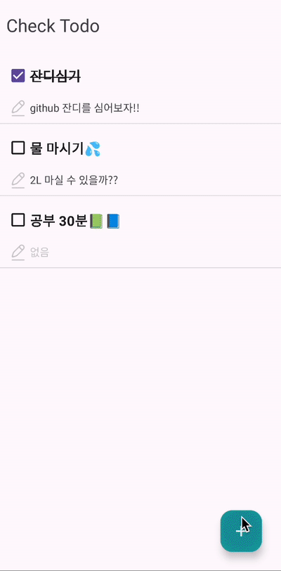

# 📋 두잇두잇

Android 개인 프로젝트

## 프로젝트 소개

할 일을 설정하고 체크할 수 있는 목표 관리 앱

### 🛠️ 사용 기술

- [MVVM](https://github.com/min486/Android/tree/master/%EC%95%84%ED%82%A4%ED%85%8D%EC%B2%98/MVVM_%ED%8C%A8%ED%84%B4)
- [Hilt](https://github.com/min486/Android/tree/master/Android/%EC%9D%98%EC%A1%B4%EC%84%B1%EC%A3%BC%EC%9E%85-Hilt)
- [Coroutine](https://github.com/min486/Android/tree/master/Kotlin/%EC%BD%94%EB%A3%A8%ED%8B%B4)
- [Flow](https://github.com/min486/Android/tree/master/Kotlin/Flow)
- [Room](https://github.com/min486/Android/tree/master/Android/Room)
- SNS 로그인

### 🖥️ 개발 환경

- Programming Language : `Kotlin`
- IDE : `Android Studio`
- Minimum SDK Version : `28`
- Compile SDK Version : `33`
- Target SDK Version : `33`

 

## 주요 기능

|                 SNS 로그인 (카카오, 네이버)                  |                      할 일 생성 / 체크                       |                      할 일 수정 / 삭제                       |
| :----------------------------------------------------------: | :----------------------------------------------------------: | :----------------------------------------------------------: |
|  |  |  |
